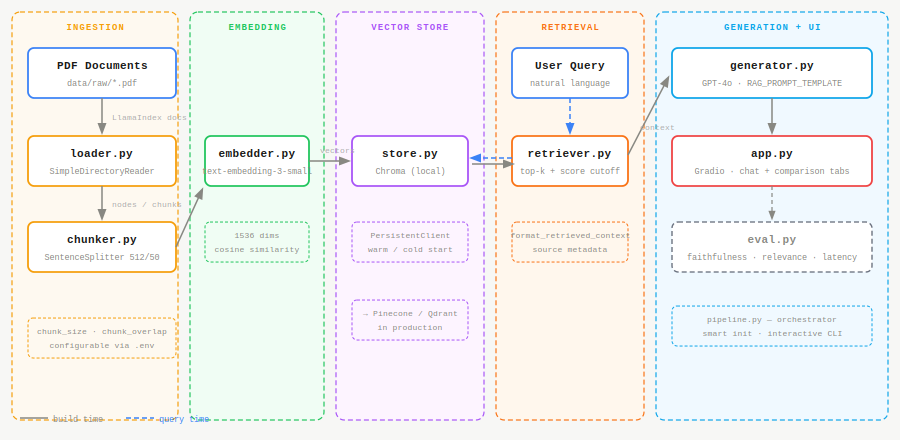
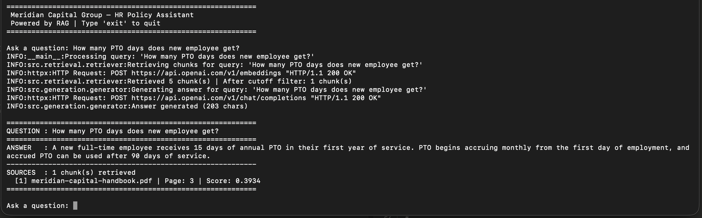
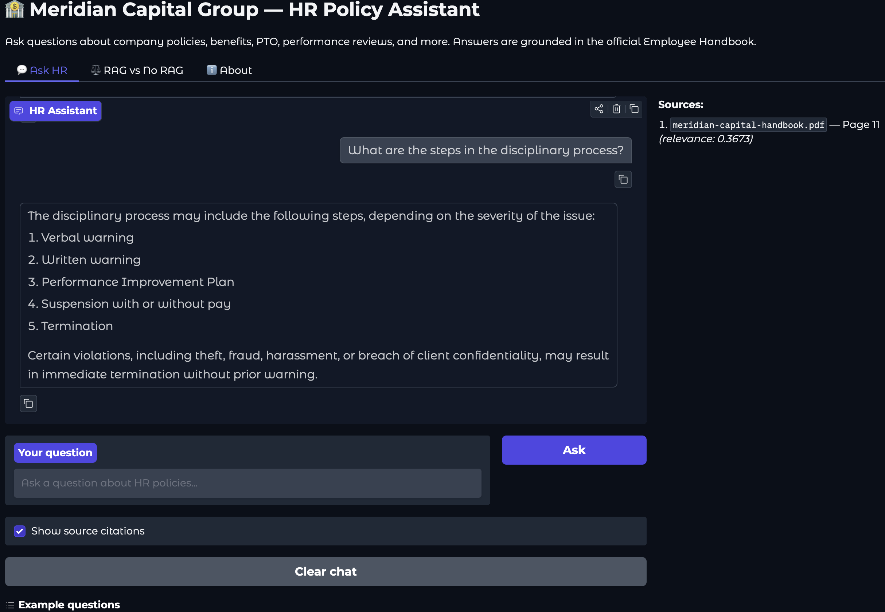
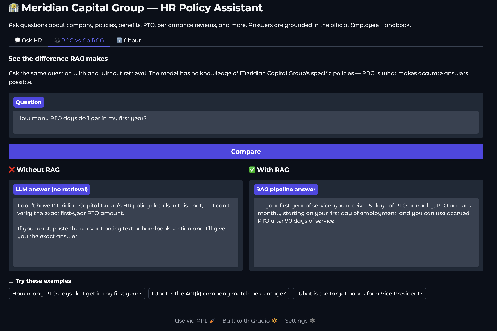

# rag-pipeline

A modular Retrieval-Augmented Generation (RAG) pipeline built for clarity, extensibility, and real-world applicability. This project demonstrates core RAG concepts including document ingestion, chunking, embedding, vector retrieval, and LLM-based generation.

---

## Overview

RAG is a technique that enhances LLM responses by retrieving relevant context from a knowledge base before generating an answer. Rather than relying solely on the model's training data, the pipeline fetches the most relevant document chunks at query time and passes them as context to the LLM.



---

## Tech Stack

| Layer | Tool |
|---|---|
| LLM | OpenAI GPT-4o (Anthropic Claude via env toggle) |
| Embeddings | OpenAI text-embedding-3-small |
| Vector Store | Chroma (local) |
| Framework | LlamaIndex |
| UI | Gradio |

---

## Repo Structure

```
rag-pipeline/
├── data/
│   ├── raw/
│   └── processed/
├── src/
│   ├── ingestion/
│   │   ├── loader.py
│   │   └── chunker.py
│   ├── embedding/
│   │   └── embedder.py
│   ├── vectorstore/
│   │   └── store.py
│   ├── retrieval/
│   │   └── retriever.py
│   ├── generation/
│   │   └── generator.py
│   └── pipeline.py
├── evaluation/
│   └── eval.py
├── notebooks/
│   └── exploration.ipynb
├── ui/
│   └── app.py
├── tests/
│   └── test_pipeline.py
├── .env.sample
├── requirements.txt
├── Dockerfile
└── README.md
```

---

## Getting Started

**Prerequisites**
- Python 3.10+
- OpenAI or Anthropic API key

**Installation**

Using `venv`:
```bash
git clone https://github.com/tohio/rag-pipeline.git
cd rag-pipeline
python -m venv .venv
source .venv/bin/activate  # Windows: .venv\Scripts\activate
pip install -r requirements.txt
cp .env.sample .env
# Add your API keys to .env
```

Using `uv`:
```bash
git clone https://github.com/tohio/rag-pipeline.git
cd rag-pipeline
uv venv
source .venv/bin/activate  # Windows: .venv\Scripts\activate
uv pip install -r requirements.txt
cp .env.sample .env
# Add your API keys to .env
```

**Run the pipeline**

```bash
python src/pipeline.py
```

**Launch the UI**

```bash
python ui/app.py
```

The UI will be available at `http://localhost:7860` in your browser. To expose a public shareable link, set `share=True` in `demo.launch()` inside `ui/app.py` — Gradio will print a public URL to the terminal.

**Run evaluation**

```bash
python evaluation/eval.py --qa evaluation/qa_pairs.json --output evaluation/results.json
```

**Run with Docker**

```bash
docker build -t rag-pipeline .
docker run --env-file .env -p 7860:7860 rag-pipeline
```

The UI will be available at `http://localhost:7860`. Pass your API keys via the `.env` file — do not bake them into the image.

**Run tests**

```bash
pytest tests/test_pipeline.py
```

---

## Screenshots

**CLI — pipeline query with source citation**



> Query: *"How many PTO days does a new employee get?"*
> Retrieved 1 chunk from `meridian-capital-handbook.pdf` (Page 3, score 0.3934) and generated a grounded answer.

**Gradio UI — Ask HR tab**



> Query: *"What are the steps in the disciplinary process?"*
> Answer grounded in Page 11 of the handbook with source citation displayed in the panel.

**Gradio UI — RAG vs No RAG tab**



> Same question asked with and without retrieval. Without RAG the model acknowledges it has no knowledge of Meridian Capital Group's policies. With RAG it returns the exact answer from the handbook.

---

## Key Design Decisions

**LlamaIndex as the core framework** — ingestion, chunking, embedding, and retrieval are all built on LlamaIndex primitives (`SimpleDirectoryReader`, `SentenceSplitter`, `OpenAIEmbedding`, `VectorIndexRetriever`), with provider settings managed globally via `Settings`.

**Chunking strategy** — documents are split using `SentenceSplitter` at 512 tokens with 50-token overlap to preserve context across chunk boundaries. Chunk size and overlap are configurable via environment variables.

**Vector store** — Chroma is used for local development via `PersistentClient`, with warm/cold start logic to avoid rebuilding the index on every run. The vector store interface is designed to be provider-agnostic — see production considerations below.

**Multiple LLMs** — the generation layer supports swapping between OpenAI and Anthropic providers via a single environment variable, making it straightforward to compare output quality across models on the same retrieval results.

**Evaluation first** — ground truth Q&A pairs are defined in `evaluation/` before running the pipeline, enabling consistent measurement of faithfulness, relevance, and latency across changes.

---

## Evaluation

The `evaluation/` module measures retrieval hit rate, answer faithfulness, answer relevance, and end-to-end latency per query. An LLM-as-judge approach scores faithfulness and relevance on a 1–5 scale against the ground truth Q&A pairs.

---

## Production Considerations

This project is intentionally scoped for demonstration. In a production system:

- **Vector store** — Chroma would be replaced by a managed service such as Pinecone or Qdrant for scalability and persistence across deployments.
- **Memory** — short-term conversational memory would be backed by Redis for persistent, low-latency session storage across multiple users and requests.
- **API layer** — the pipeline would be exposed via a FastAPI service with proper authentication, rate limiting, and async request handling.
- **Frontend** — the Gradio UI would be replaced by a React or Next.js frontend consuming the API.
- **Observability** — LangSmith or Arize would be added for tracing, logging, and monitoring retrieval and generation quality in production.

---

## Related Project

This repo is the foundation for [agentic-rag](https://github.com/tohio/agentic-rag), which extends this pipeline with tool use, query routing, multi-step reasoning, and agent memory.